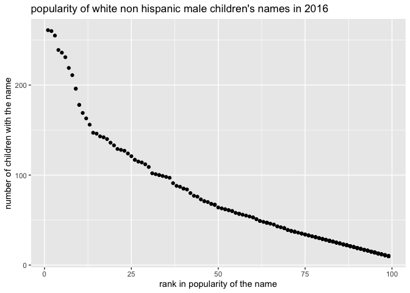

Simple document
================
Yuanyuan Zeng

## Problem 1

``` r
# Read and clean the Mr.Trash Wheel sheet
trash_data = 
  read_excel("./data/Trash-Wheel-Collection-Totals-7-2020-2.xlsx", sheet = "Mr. Trash Wheel", range = "A2:N535") %>%
  janitor::clean_names() %>% 
  filter(dumpster != "NA") %>% 
  mutate(
    sports_balls = round(sports_balls))

head(trash_data, 5)
```

    ## # A tibble: 5 × 14
    ##   dumpster month  year date                weight_tons volume_cubic_yards
    ##   <chr>    <chr> <dbl> <dttm>                    <dbl>              <dbl>
    ## 1 1        May    2014 2014-05-16 00:00:00        4.31                 18
    ## 2 2        May    2014 2014-05-16 00:00:00        2.74                 13
    ## 3 3        May    2014 2014-05-16 00:00:00        3.45                 15
    ## 4 4        May    2014 2014-05-17 00:00:00        3.1                  15
    ## 5 5        May    2014 2014-05-17 00:00:00        4.06                 18
    ## # … with 8 more variables: plastic_bottles <dbl>, polystyrene <dbl>,
    ## #   cigarette_butts <dbl>, glass_bottles <dbl>, grocery_bags <dbl>,
    ## #   chip_bags <dbl>, sports_balls <dbl>, homes_powered <dbl>

``` r
# Read and clean the precipitation data for 2018
pre_2018 = (
  read_excel("./data/Trash-Wheel-Collection-Totals-7-2020-2.xlsx", sheet = "2018 Precipitation", range = "A2:B14") %>% 
    janitor::clean_names() %>% 
    mutate(year = 2018) %>%  
    relocate(year))
head(pre_2018, 5)
```

    ## # A tibble: 5 × 3
    ##    year month total
    ##   <dbl> <dbl> <dbl>
    ## 1  2018     1  0.94
    ## 2  2018     2  4.8 
    ## 3  2018     3  2.69
    ## 4  2018     4  4.69
    ## 5  2018     5  9.27

``` r
# Calculate total precipitation in 2018
sum(pull(pre_2018,var =3))
```

    ## [1] 70.33

``` r
# Read and clean the precipitation data for 2019
pre_2019 = (
  read_excel("./data/Trash-Wheel-Collection-Totals-7-2020-2.xlsx", sheet = "2019 Precipitation", range = "A2:B14") %>% 
    janitor::clean_names() %>% 
    mutate(year = 2019) %>% 
    relocate(year)
  )

head(pre_2019, 5)
```

    ## # A tibble: 5 × 3
    ##    year month total
    ##   <dbl> <dbl> <dbl>
    ## 1  2019     1  3.1 
    ## 2  2019     2  3.64
    ## 3  2019     3  4.47
    ## 4  2019     4  1.46
    ## 5  2019     5  3.58

``` r
# Combine two precipitation data
precipitation_data = (
  bind_rows(pre_2018, pre_2019) %>% 
  mutate(month = month.name[as.numeric(month)])
)

head(precipitation_data, 5)
```

    ## # A tibble: 5 × 3
    ##    year month    total
    ##   <dbl> <chr>    <dbl>
    ## 1  2018 January   0.94
    ## 2  2018 February  4.8 
    ## 3  2018 March     2.69
    ## 4  2018 April     4.69
    ## 5  2018 May       9.27

``` r
# find the median of number of sports ball in dumpster in 2019
filter(trash_data, year == "2019") %>% 
  pull(sports_balls) %>% 
  median()
```

    ## [1] 9

-   The trash\_data contains 488 rows and 14 columns. There are 14
    variables which are dumpster, month, year, data, weight\_tons,
    volume\_cubic\_yards, plastic\_bottles, polystyrene,
    cigarette\_butts, grocery\_bags, chip\_bags, sports\_balls, and
    homes\_powered. Dumpster and month are character variables. Others
    are numeric variables. The tables both pre\_2018 and pre\_2019
    contains 12 rows and 3 colors. There are three numeric variables
    which are year, month, and total. Combining two precipitation data,
    we get a table named precipitation\_data which contains 24 rows and
    3 columns. The variable name are the same as two separated tables.
    The total precipitation in 2018 is 70.33 inches. The median number
    of sports balls in dumspter in 2019 is 9.

## Problem 2

``` r
# Clean the data in pols-month.csv
pols_month = 
  read_csv("./data/pols-month.csv") %>% 
  separate(mon,  into = c("year", "month", "day"), sep = "-") %>% 
  mutate(
    month = month.name[as.numeric(month)]) %>% 
  pivot_longer(
    prez_gop | prez_dem,
    names_to = "president",
    names_prefix = "prez_",
    values_to = "gop_or_dem") %>% 
  filter( gop_or_dem!=0 ) %>% 
  select(!day & !gop_or_dem) %>% 
  relocate(year, month, president, everything())

head(pols_month, 5)
```

    ## # A tibble: 5 × 9
    ##   year  month    president gov_gop sen_gop rep_gop gov_dem sen_dem rep_dem
    ##   <chr> <chr>    <chr>       <dbl>   <dbl>   <dbl>   <dbl>   <dbl>   <dbl>
    ## 1 1947  January  dem            23      51     253      23      45     198
    ## 2 1947  February dem            23      51     253      23      45     198
    ## 3 1947  March    dem            23      51     253      23      45     198
    ## 4 1947  April    dem            23      51     253      23      45     198
    ## 5 1947  May      dem            23      51     253      23      45     198

``` r
# Clean the data in snp.csv
snp_df = 
  read_csv("./data/snp.csv") %>% 
  mutate(
    date = mdy(date)
  ) %>% 
  separate(date, into = c("year", "month", "day"), sep = "-") %>% 
  mutate(
    year = ifelse(as.numeric(year)>2049, as.numeric(year)-100, year)
  ) %>% 
  mutate(
    month = month.name[as.numeric(month)]
    ) %>% 
  select(!day) %>% 
  relocate(year)

head(snp_df, 5)
```

    ## # A tibble: 5 × 3
    ##   year  month close
    ##   <chr> <chr> <dbl>
    ## 1 2015  July  2080.
    ## 2 2015  June  2063.
    ## 3 2015  May   2107.
    ## 4 2015  April 2086.
    ## 5 2015  March 2068.

``` r
# Clean th unemployment data 
unemployment_df = 
  read_csv("./data/unemployment.csv", col_types = "cdddddddddddd") %>% 
  pivot_longer(
    Jan : Dec,
    names_to = "month",
    values_to = "unemployment"
  ) %>% 
  filter(unemployment !="NA") %>% 
  janitor::clean_names() %>% 
  mutate(
    month = match(month, month.abb),
    month = month.name[as.numeric(month)]
  ) %>% 
  arrange(desc(year)) 

head(unemployment_df, 5)
```

    ## # A tibble: 5 × 3
    ##   year  month    unemployment
    ##   <chr> <chr>           <dbl>
    ## 1 2015  January           5.7
    ## 2 2015  February          5.5
    ## 3 2015  March             5.5
    ## 4 2015  April             5.4
    ## 5 2015  May               5.5

``` r
# left join snp into pols data set
pols_snp =
  left_join(pols_month, snp_df, by = c("year","month"))

# left join unemployment into pols_snp 
pols_snp_unemp =
  left_join(pols_snp, unemployment_df, by = c("year", "month"))

# find the range of year in the data set
range(pull(pols_snp,var =1))
```

    ## [1] "1947" "2015"

-   In the pols\_month data set, there are 822 rows and 9 variables. The
    year, month, and president are character variables. The column of
    president show either dem or gop. The data set of snp\_df contains
    787 rows and 3 variables which are year, month and close. The close
    represents the closing values of the S&P stock index. The data set
    of unemployment\_df contains 810 rows and 3 variables which are
    year, month, and unemployment. We merge the snp\_df into lops\_month
    by using left join which means that we keep everything in
    lops\_month dataset and add closing values of stock into it. The
    resulting data set is pols\_snp, which contains 822 rows and 10
    variables. The year ranges from 1947 to 2015. The resulting data set
    of merging unemployment into pols\_snp contains same number of rows
    as before and have one additional variable called unemployment.There
    are 822 rows and 11 variables. There are missing values in column of
    close and unemployment, which means that closing value of stock and
    unemployment are not available to the corresponding year and month.

## Problem 3

``` r
# Clean the data on popularity of baby names
baby_names = 
  read.csv("./data/Popular_Baby_Names.csv") %>% 
  janitor::clean_names() %>%
  distinct() %>% 
  mutate(
    gender = tolower(gender),
    ethnicity = tolower(ethnicity),
    ethnicity = replace(ethnicity, ethnicity == "asian and paci", "asian and pacific islander"),
    ethnicity = replace(ethnicity, ethnicity == "black non hisp", "black non hispanic"),
    ethnicity = replace(ethnicity, ethnicity == "white non hisp", "white non hispanic"),
    child_s_first_name = tolower(child_s_first_name)
  )

head(baby_names, 5)
```

    ##   year_of_birth gender                  ethnicity child_s_first_name count rank
    ## 1          2016 female asian and pacific islander             olivia   172    1
    ## 2          2016 female asian and pacific islander              chloe   112    2
    ## 3          2016 female asian and pacific islander             sophia   104    3
    ## 4          2016 female asian and pacific islander              emily    99    4
    ## 5          2016 female asian and pacific islander               emma    99    4

``` r
# Create table showing popularity of the name "Olivia"
olivia_df =
  baby_names %>% 
  select(-count) %>% 
  filter(child_s_first_name == "olivia") %>% 
  pivot_wider(
    names_from = "year_of_birth",
    values_from = "rank"
  )

# Create table showing popularity of the most popular name among male children over time
popular_names =
  baby_names %>% 
  select(-count) %>% 
  filter(
    gender != "female",
    rank == "1"
  ) %>% 
  pivot_wider(
    names_from = "year_of_birth",
    values_from = "child_s_first_name"
  )

# Produce scatter plot
male_non_his =
  baby_names %>% 
  filter(
    gender != "female",
    year_of_birth == "2016",
    ethnicity == "white non hispanic"
  )

ggplot(male_non_his, aes(x= rank, y = count))+
  geom_point() +
  labs(
    title = "popularity of white non hispanic male children's names",
    x = "rank in popularity of the name",
    y = "number of children with the name"
  )
```

<!-- -->
