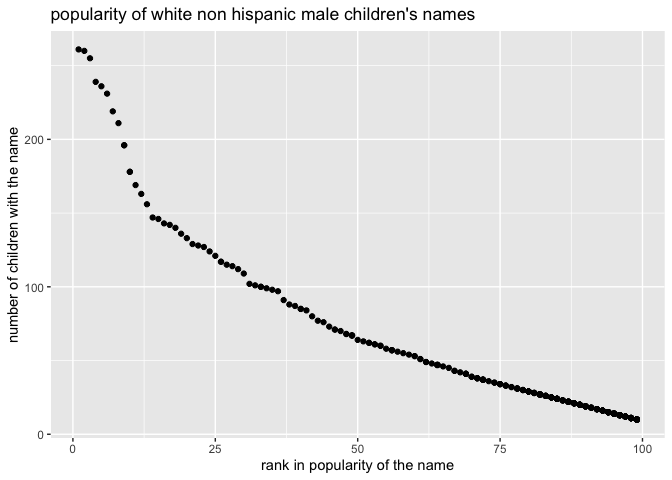

Simple document
================
Yuanyuan Zeng

    ## ── Attaching packages ─────────────────────────────────────── tidyverse 1.3.1 ──

    ## ✓ ggplot2 3.3.5     ✓ purrr   0.3.4
    ## ✓ tibble  3.1.4     ✓ dplyr   1.0.7
    ## ✓ tidyr   1.1.3     ✓ stringr 1.4.0
    ## ✓ readr   2.0.1     ✓ forcats 0.5.1

    ## ── Conflicts ────────────────────────────────────────── tidyverse_conflicts() ──
    ## x dplyr::filter() masks stats::filter()
    ## x dplyr::lag()    masks stats::lag()

    ## 
    ## Attaching package: 'lubridate'

    ## The following objects are masked from 'package:base':
    ## 
    ##     date, intersect, setdiff, union

## Problem 1

``` r
# Read and clean the Mr.Trash Wheel sheet
trash_data = 
  read_excel("./Trash-Wheel-Collection-Totals-7-2021-sept.xlsx", sheet = "Mr. Trash Wheel") %>% 
  janitor::clean_names() %>% 
  select(dumpster:homes_powered) %>% 
  filter(dumpster != "NA") %>% 
  mutate(
    sports_balls = round(sports_balls))
```

    ## New names:
    ## * `` -> ...15
    ## * `` -> ...16
    ## * `` -> ...17

``` r
str(trash_data)
```

    ## tibble [488 × 14] (S3: tbl_df/tbl/data.frame)
    ##  $ dumpster          : chr [1:488] "1.0" "2.0" "3.0" "4.0" ...
    ##  $ month             : chr [1:488] "May" "May" "May" "May" ...
    ##  $ year              : num [1:488] 2014 2014 2014 2014 2014 ...
    ##  $ date              : POSIXct[1:488], format: "2014-05-16" "2014-05-16" ...
    ##  $ weight_tons       : num [1:488] 4.31 2.74 3.45 3.1 4.06 2.71 1.91 3.7 2.52 3.76 ...
    ##  $ volume_cubic_yards: num [1:488] 18 13 15 15 18 13 8 16 14 18 ...
    ##  $ plastic_bottles   : num [1:488] 1450 1120 2450 2380 980 1430 910 3580 2400 1340 ...
    ##  $ polystyrene       : num [1:488] 1820 1030 3100 2730 870 2140 1090 4310 2790 1730 ...
    ##  $ cigarette_butts   : num [1:488] 126000 91000 105000 100000 120000 90000 56000 112000 98000 130000 ...
    ##  $ glass_bottles     : num [1:488] 72 42 50 52 72 46 32 58 49 75 ...
    ##  $ grocery_bags      : num [1:488] 584 496 1080 896 368 ...
    ##  $ chip_bags         : num [1:488] 1162 874 2032 1971 753 ...
    ##  $ sports_balls      : num [1:488] 7 5 6 6 7 5 3 6 6 7 ...
    ##  $ homes_powered     : num [1:488] 0 0 0 0 0 0 0 0 0 0 ...

``` r
# Read and clean the precipitation data for 2018
pre_2018 = (
  read_excel("./Trash-Wheel-Collection-Totals-7-2021-sept.xlsx", sheet = "2018 Precipitation", range = "A2:B14") %>% 
    janitor::clean_names() %>% 
    mutate(year = 2018) %>%  
    relocate(year))
str(pre_2018)
```

    ## tibble [12 × 3] (S3: tbl_df/tbl/data.frame)
    ##  $ year : num [1:12] 2018 2018 2018 2018 2018 ...
    ##  $ month: num [1:12] 1 2 3 4 5 6 7 8 9 10 ...
    ##  $ total: num [1:12] 0.94 4.8 2.69 4.69 9.27 ...

``` r
# Calculate total precipitation in 2018
sum(pull(pre_2018,var =3))
```

    ## [1] 70.33

``` r
# Read and clean the precipitation data for 2019
pre_2019 = (
  read_excel("./Trash-Wheel-Collection-Totals-7-2021-sept.xlsx", sheet = "2019 Precipitation", range = "A2:B14") %>% 
    janitor::clean_names() %>% 
    mutate(year = 2019) %>% 
    relocate(year))
str(pre_2019)
```

    ## tibble [12 × 3] (S3: tbl_df/tbl/data.frame)
    ##  $ year : num [1:12] 2019 2019 2019 2019 2019 ...
    ##  $ month: num [1:12] 1 2 3 4 5 6 7 8 9 10 ...
    ##  $ total: num [1:12] 3.1 3.64 4.47 1.46 3.58 0.42 3.85 2.39 0.16 5.45 ...

``` r
# Combine two precipitation data
precipitation_data = (
  bind_rows(pre_2018, pre_2019) %>% 
  mutate(month = month.name[as.numeric(month)])
)
str(precipitation_data)
```

    ## tibble [24 × 3] (S3: tbl_df/tbl/data.frame)
    ##  $ year : num [1:24] 2018 2018 2018 2018 2018 ...
    ##  $ month: chr [1:24] "January" "February" "March" "April" ...
    ##  $ total: num [1:24] 0.94 4.8 2.69 4.69 9.27 ...

``` r
# find the median of number of sports ball in dumpster in 2019
filter(trash_data, year == "2019") %>% 
  pull(sports_balls) %>% 
  median()
```

    ## [1] 9

-   The trash\_data contains 488 rows and 14 columns. There are 14
    variables which are dumpster, month, year, data, weight\_tons,
    volume\_cubic\_yards, plastic\_bottles, polystyrene,
    cigarette\_butts, grocery\_bags, chip\_bags, sports\_balls, and
    homes\_powered. Dumpster and month are character variables. Others
    are numeric variables. The tables both pre\_2018 and pre\_2019
    contains 12 rows and 3 colors. There are three numeric variables
    which are year, month, and total. The total precipitation in 2018 is
    70.33 inches. Combining two precipitation data, we get a table named
    precipitation\_data which contains 24 rows and 3 colomns. The
    variable name are the same as two seperated tables.

## Problem 2

``` r
# Clean the data in pols-month.csv
pols_month = 
  read_csv("./fivethirtyeight_datasets/pols-month.csv") %>% 
  separate(mon,  into = c("year", "month", "day"), sep = "-") %>% 
  mutate(month = month.name[as.numeric(month)]) %>% 
  pivot_longer(
    prez_gop | prez_dem,
    names_to = "president",
    names_prefix = "prez_",
    values_to = "gop_or_dem") %>% 
  filter( gop_or_dem!=0 ) %>% 
  select(!day & !gop_or_dem) %>% 
  relocate(year, month, president, everything())
```

    ## Rows: 822 Columns: 9

    ## ── Column specification ────────────────────────────────────────────────────────
    ## Delimiter: ","
    ## dbl  (8): prez_gop, gov_gop, sen_gop, rep_gop, prez_dem, gov_dem, sen_dem, r...
    ## date (1): mon

    ## 
    ## ℹ Use `spec()` to retrieve the full column specification for this data.
    ## ℹ Specify the column types or set `show_col_types = FALSE` to quiet this message.

``` r
pols_month
```

    ## # A tibble: 822 × 9
    ##    year  month     president gov_gop sen_gop rep_gop gov_dem sen_dem rep_dem
    ##    <chr> <chr>     <chr>       <dbl>   <dbl>   <dbl>   <dbl>   <dbl>   <dbl>
    ##  1 1947  January   dem            23      51     253      23      45     198
    ##  2 1947  February  dem            23      51     253      23      45     198
    ##  3 1947  March     dem            23      51     253      23      45     198
    ##  4 1947  April     dem            23      51     253      23      45     198
    ##  5 1947  May       dem            23      51     253      23      45     198
    ##  6 1947  June      dem            23      51     253      23      45     198
    ##  7 1947  July      dem            23      51     253      23      45     198
    ##  8 1947  August    dem            23      51     253      23      45     198
    ##  9 1947  September dem            23      51     253      23      45     198
    ## 10 1947  October   dem            23      51     253      23      45     198
    ## # … with 812 more rows

``` r
# Clean the data in snp.csv
snp_df = 
  read_csv("./fivethirtyeight_datasets/snp.csv") %>% 
  mutate(
    date = mdy(date)
  ) %>% 
  separate(date, into = c("year", "month", "day"), sep = "-") %>% 
  mutate(
    year = ifelse(as.numeric(year)>2049, as.numeric(year)-100, year)
  ) %>% 
  mutate(
    month = month.name[as.numeric(month)]
    ) %>% 
  select(!day) %>% 
  relocate(year) %>% 
  arrange(desc(year))
```

    ## Rows: 787 Columns: 2

    ## ── Column specification ────────────────────────────────────────────────────────
    ## Delimiter: ","
    ## chr (1): date
    ## dbl (1): close

    ## 
    ## ℹ Use `spec()` to retrieve the full column specification for this data.
    ## ℹ Specify the column types or set `show_col_types = FALSE` to quiet this message.

``` r
snp_df
```

    ## # A tibble: 787 × 3
    ##    year  month    close
    ##    <chr> <chr>    <dbl>
    ##  1 2015  July     2080.
    ##  2 2015  June     2063.
    ##  3 2015  May      2107.
    ##  4 2015  April    2086.
    ##  5 2015  March    2068.
    ##  6 2015  February 2104.
    ##  7 2015  January  1995.
    ##  8 2014  December 2059.
    ##  9 2014  November 2068.
    ## 10 2014  October  2018.
    ## # … with 777 more rows

``` r
# Clean th unemployment data 
unemployment_df = 
  read_csv("./fivethirtyeight_datasets/unemployment.csv", col_types = "cdddddddddddd") %>% 
  pivot_longer(
    Jan : Dec,
    names_to = "month",
    values_to = "unemployment"
  ) %>% 
  filter(unemployment !="NA") %>% 
  janitor::clean_names() %>% 
  mutate(
    month = match(month, month.abb),
    month = month.name[as.numeric(month)]
  ) %>% 
  arrange(desc(year)) 

unemployment_df
```

    ## # A tibble: 810 × 3
    ##    year  month    unemployment
    ##    <chr> <chr>           <dbl>
    ##  1 2015  January           5.7
    ##  2 2015  February          5.5
    ##  3 2015  March             5.5
    ##  4 2015  April             5.4
    ##  5 2015  May               5.5
    ##  6 2015  June              5.3
    ##  7 2014  January           6.6
    ##  8 2014  February          6.7
    ##  9 2014  March             6.6
    ## 10 2014  April             6.2
    ## # … with 800 more rows

``` r
# left join snp into pols data set
pols_snp =
  left_join(pols_month, snp_df, by = c("year","month"))

# left join unemployment into pols_snp 
pols_snp_unemp =
  left_join(pols_snp, unemployment_df, by = c("year", "month"))
```

## Problem 3

``` r
# Clean the data on popularity of baby names
baby_names = 
  read.csv("./Popular_Baby_Names.csv") %>% 
  janitor::clean_names() %>%
  distinct() %>% 
  mutate(
    gender = tolower(gender),
    ethnicity = tolower(ethnicity),
    ethnicity = replace(ethnicity, ethnicity == "asian and paci", "asian and pacific islander"),
    ethnicity = replace(ethnicity, ethnicity == "black non hisp", "black non hispanic"),
    ethnicity = replace(ethnicity, ethnicity == "white non hisp", "white non hispanic"),
    child_s_first_name = tolower(child_s_first_name)
  )

head(baby_names)
```

    ##   year_of_birth gender                  ethnicity child_s_first_name count rank
    ## 1          2016 female asian and pacific islander             olivia   172    1
    ## 2          2016 female asian and pacific islander              chloe   112    2
    ## 3          2016 female asian and pacific islander             sophia   104    3
    ## 4          2016 female asian and pacific islander              emily    99    4
    ## 5          2016 female asian and pacific islander               emma    99    4
    ## 6          2016 female asian and pacific islander                mia    79    5

``` r
# Create table showing popularity of the name "Olivia"
olivia_df =
  baby_names %>% 
  filter(child_s_first_name == "olivia") %>% 
  arrange(desc(rank)) # how to arrange something in increasing order??

# Create table showing popularity of the most popular name among male children over time
popular_names =
  baby_names %>% 
  filter(
    gender != "female",
    rank == "1"
  )

# Produce scatter plot
male_non_his =
  baby_names %>% 
  filter(
    gender != "female",
    year_of_birth == "2016",
    ethnicity == "white non hispanic"
  )

ggplot(male_non_his, aes(x= rank, y = count))+
  geom_point() +
  labs(
    title = "popularity of white non hispanic male children's names",
    x = "rank in popularity of the name",
    y = "number of children with the name"
  )
```

<!-- -->
